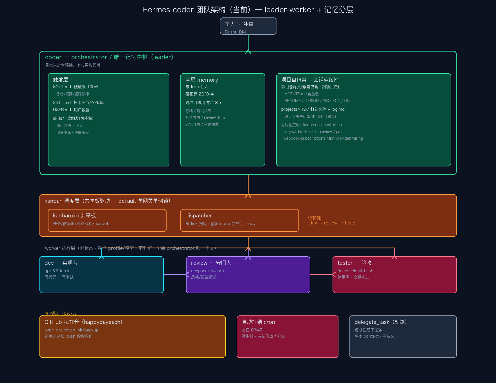

# Hermes coder 团队架构设计

> 记录日期：2026-09-20
> 架构图：`coder-architecture.png`
> 状态：设计讨论稿（仅讨论，未涉及代码实现）

---

## 0. 架构总览

一句话：**coder 是唯一长期记忆中枢（leader），dev / review / tester 是无状态 worker，由 kanban dispatcher 依依赖链调度；记忆分层「硬触发 / 软触发 / 全局 / 项目自包含 / 打结」承载跨会话连续性。**

---

## 1. 记忆系统设计（5 层）

核心原则：**「记忆跟着项目走 + 全局只留通用约定」**。

| 层 | 载体 | 触发 | 存什么 |
|---|---|---|---|
| 硬触发 | `SOUL.md` | 每 session 100% 加载 | 身份 / 规则 / 流程铁律，写通用规则 + `<变量>` |
| 软触发 | `skills/<项目名>/` | 按需加载（可能漏） | 技术细节 / 坑 / 范式 |
| 全局 memory | 每 turn 注入 | 100% | 只留跨项目通用约定（硬预算 2200 字） |
| 项目自包含 | 仓库 `AGENTS.md` + README / DESIGN / PROJECT_LOG | 进项目即加载 | 项目专属知识 |
| 会话连续性 | `projects/<名>/…打结.md` + 记忆指针 | 打结时读 | 跨天状态快照 |

关键：项目专属知识**必须**进项目仓库文档（自包含、跟着项目走），部署到别处无记忆 agent 也能靠文档自引导；全局 memory 只留跨项目通用约定，故能压在 2200 字内不爆。

### 软触发 vs 硬触发（关键经验）

- **skill 是软触发**（按需加载，靠扫列表 + 判断，可能漏）。
- **SOUL.md 是硬触发**（每 session 加载）。
- 关键流程 / 规则必须写进 SOUL.md 才 100% 保证；SOUL.md 写通用规则 + `<变量>`（如 `<项目名>`），不写死具体项目名。

---

## 2. 新闻长期跟踪 / 深度分析项目的记忆设计

新闻项目本质是「事件流 + 去重状态 + 结论」，不是代码 diff，记忆对象不同：

- **跟踪状态指针**（放仓库）：已跟踪源列表、每源处理到的时间点、去重 key（URL/标题 hash）——增量续接，不重跑。
- **append-only 事件时间线 + 覆盖式结论快照**：时间线只追加，最新结论快照覆盖，避免每次全量重读。
- **结论库**：已分析主题 → 结论/观点，防重复分析。
- **复用打结机制**：每日快照记录「跟踪到哪 + 最新结论 + 待跟踪队列」。

与普通项目的差异：普通项目记忆是「当前代码状态」，新闻项目记忆必须同时有「历史时间线 + 当前结论 + 去重指针」三样。

---

## 3. 换更好模型（如 pi）的设计

靠「**记忆与执行解耦**」天然支持：

- **稳定层（模型无关）**：coder 的沉淀（项目文档 + skills + memory）是持久资产，换任何模型都不丢。
- **可替换层（无状态）**：dev / review / tester 是无状态 worker，换模型 = 改 profile 的 provider/model 配置，零迁移成本。
- **换模型动作**：改 profile 配置 → 用现有验收用例 + 项目文档自引导能力做基准 → 验证真更好才切。
- **coder 永远用最聪明模型**：coder 是唯一记忆持有者，决策质量决定全队上限，故「省 token」前提下 coder 层模型质量优先级最高。

关键认知：换模型成本不在「迁移」，在「验证新模型是否真更好」——项目文档自包含 + 验收用例就是现成基准。

---

## 4. leader-worker 架构 + Hermes 多 agent 调度

### 为什么 leader-worker

- **记忆唯一**：coder 是唯一长期记忆中枢，worker 无状态不互相污染。
- **上下文隔离**：每 worker 独立 spawn、独立 session，上下文不膨胀。
- **职责分离 + 交叉守门**：dev / review / tester 各司其职，review 独立质检。
- **编排可控**：orchestrator 拆卡建依赖链，不亲自写实现代码。

### Hermes 怎么调多 agent（两条路）

1. **kanban dispatcher（主路）**：共享 `kanban.db`。orchestrator 建卡 `dev → review → tester` 依赖链 → dispatcher 每 tick 扫板，前驱 done 才把 ready 卡 spawn 给对应 profile 的 worker（独立模型/独立 session，不驻留）。跨 agent 通信靠「板上卡片 + 评论线程 + 完成时 handoff」。
2. **delegate_task（副路）**：短期推理子任务，隔离 context 只回传 summary；不持久、不跨 session，不用于板上跨 agent 交接。

---

## 5. 防幻觉设计（多层防御）

1. **异质模型交叉检查**：dev / review / tester 用不同模型，单一模型系统性偏见被另一模型捕获；review 用推理档守门。
2. **真实工具输出验证**：强制读回验证，禁止编造结果（宁可 block 上报，不编）。
3. **DoD + 全绿验收**：tester 跑真实用例全绿才过；失败自改上限 3 次，满 3 次 block 上报主人。
4. **ground truth 沉淀**：项目文档 + 打结文件是唯一事实来源，压掉「记错状态」型幻觉。
5. **硬触发规则**：铁律写 SOUL.md（100% 加载），不靠软触发（会漏）。
6. **coder 最聪明 + 积累沉淀**：幻觉风险最高的决策层用最强模型 + 经验越滚越多。

### 已知短板（待改进）

- coder 会话超 24h 无激活会重置（`idle_minutes=1440`），多天连续性目前靠打结文件 + 记忆指针兜底，无系统性方案。
- worker 无状态全靠 orchestrator 喂上下文，喂错 / 喂漏会放大幻觉。

---

## 6. 沉淀资产盘点

### 方法论 skill（6 个，下个项目 100% 复用）

| skill | 用途 |
|---|---|
| kanban-orchestration | 拆卡 / 建依赖链 / 返工 / 测试组织 / 记忆分层的通用方法与坑 |
| project-tieoff | 打结——跨会话状态续接、收口 |
| sdlc-review | 评审 Kanban 交接、路由验证结果 |
| push-notification | 推消息到微信/飞书，先查聚合能力避免过度设计 |
| webhook-subscriptions | 创建 / 管理事件驱动的 webhook 订阅 |
| llm-provider-wiring | 把 DeepSeek / Codex-OAuth 接进项目代码 |

### 全局通用约定（5 条）

1. **打结约定**：`<项目名>+<时间>+打结.md`，跟随 git 实际修改（无新改动不新建）。
2. **测试代码组织**：按 src 模块一一对应测试文件 + `MAPPING.md` 映射表，省 token。
3. **orchestrator 拆卡方法**：改签名/配置时列全调用处 + 测试 mock 连锁反应；backup 后核对 `git HEAD == origin`。
4. **review 临时文件约定**：探针/证据统一放项目 `review_tmp/`，打结时清空。
5. **记忆分层偏好 + 软/硬触发**：项目专属进仓库文档，全局只留通用；关键规则写 SOUL.md。

### 待补：效果量化

目前「沉淀 N 个 skill」「新闻跟踪 N 主题 N 天」「开发周期 X→Y」均无数据。若要让「沉淀 → 复用 → 提效」可证明，需补：
1. 项目收口时强制提炼成真正的 SKILL.md（而非只写 log）。
2. 每个 slice 记一行时间/成本（如「slice X 用了 Y 次返工」），项目结束即可算出同类任务周期变化。
